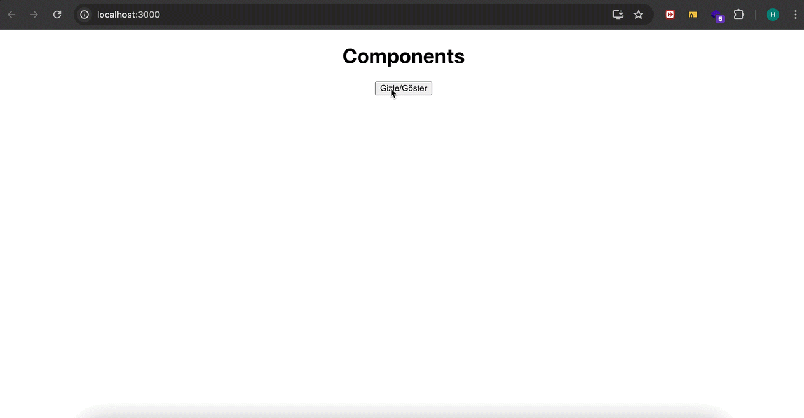

# Component

React'ta iki çeşit bileşen türü vardır:

1. Function Component

- Modern projelerde class'lar fazla kod alanı kapladığından, class'ın sahip olduğu state, lifecycle olayına sahip olmamasına rağmen react hookları sayesinde class'ların yaptığı her şeyi yapmış oluyor yani class'ların bütün özelliklerini edindiler. Ve daha az kod alanı kapladığı ve daha okunabilir olduğu için daha çok tercih edilir.

2. Class Component

- Function component'lar ortaya çıkmadan önce kullanılırlardı

- Modern projelerde yerini function component'lara bıraktılar.

- Hooks kullanımı mevcut değil

# Lifecycle (Yaşam Döngüsü)

- React bileşenleri de normal bir canlı gibi bir yaşam döngüsüne sahiptir.

- Bu döngü 3 ana aşamadan oluşur.

1. Doğma - Mount (Ekrana Basılma)

2. Gelişme - Updating (Güncelleme yani state'lerinin güncellenmesi)

3. Ölme - Unmount (Ekrandan Gitme)

- Bizim bu yaşam döngüsüne hakim olmamız gerekir, izlememiz gerekir.

- Bileşenin içerisinde yaşam bileşen ekrana basıldığında, güncellendiğinde veya ekrandan gittiğinde bir fonksiyon çalıştırmak isteyebiliriz. Örneğin bileşen ekrana basıldığında yani yüklendiğinde api isteği atmak isteyebilir. Burada da bizim için bir zorluk ortaya çıkıyor.

- Bu yüzden bu yaşam döngüsünün adımlarını izleyebilmemiz gerekir. Biz api isteği atmadan önce load yani sayfanın yüklenmesini izliyorduk.
- Class component'larda bu adımları izlemek için bazı metodlar bulunur.
- Bir bileşenin ekrana basılma yani yüklenme olayını izlemek istiyorsak, yaşam döngüsü içindeki 'mounting' kısmında componentDidMount yani bileşenim ekrana basıldı mı metodunu kullanıyoruz. componentDidUpdate, bileşenim güncellendi mi, componentWillUnmount da bileşenim ekrandan gitti mi metodları.
- componentDidMount ve diğer metodlar classComponent'a özel metodlar, bunları functional component'larda kullanamayız.

# !!!

- Class component'ların sahip olduğu ama function'ların sahip olmadığı özellikler için function'ların da bu özellikleri kullanabilmesi için react hooks ortaya çıkıyor.

- Class'ların sahip olduğu özellikleri functional component'larda kullanmamızı sağlayan fonksiyonlar. Örneğin class component'lardaki state'i function component'larda "useState" hooku kullanmamızı sağlar.

- Class component'lardaki yaşam döngüsünü funtion component'larda "useEffect" hooku kullanmamızı sağlar.

# useEffect

- Amacı: componentDidMount | componentDidUpdate | componentWillUnmount yerine function'larda kullanılır. Yani class component'larda üç farklı olay izlememizi sağlayan bu üç fonksiyonun da görevini tek başına üstleniyor funtion component'larda.

- Fonksiyonel bileşenlerde yaşam döngüsünü izlememizi sağlar.

# # useEffect'in Kullanımları

1. componentDidMount bileşenin ekrana gelme olayını izlemeye yarayan kullanım

- - 1.parametre > çalışacak fonksiyon
- - 2.parametre > boş bağımlılık dizisi
- - `useEffect(()=>{},[])` birinci parametre olarak fonksiyonu süslü parantez içinde, ikinci parametre olarak da boş diziyi köşeli parantezler içinde veriyoruz.

2. componentWillUnmount: bileşenin ekrandan gitme olayını izlemeye yarar

- - 1.parametre > çalışacak fonksiyon
- - 2.parametre > boş bağımlılık dizisi
- - çalışacak fonksiyonun return satırına bir fonksiyon daha yazarız.
- - bu yazdığımız fonksiyon bileşen ekrandan gidince çalışır.
- - `useEffect(()=>{ return () => },[])`

3. ComponentDidUpdate: Bileşene gelen prop veya state her değiştiğinde yani bileşen her render olduğunda çalışan yöntem

- - 1.parametre > çalışacak fonksiyon
- - 2.parametre yok
- - `useEffect(()=>{})`

4. ComponentDidUpdate2: Bileşende belirli bir state'in/state'lerin değişimini izlemek istediğimizde kullanılan yöntem

- - 1.parametre > çalışacak fonksiyon
- - 2.parametre > dolu bağımlılık dizisi []
- - `useEffect(()=>{}, [page, name])`

# Optional Chaining (Koşullu Zincirleme)

- Eğerki objenin bir değerinin olmama ihtimali varsa bunu ekrana basarken şu yolu izleyebiliriz:
- dog && dog.name > köpek varsa ismini ekrana bas
- dog?.name > köpek varsa ismini ekrana bas

- veri olmama durumunda ekrana bir şey gelecekse ternary tercih edilir:
- - dog ? dog.name: "karpuz"

# ReactComponents

<h2> Components Screen Gif </h2>

